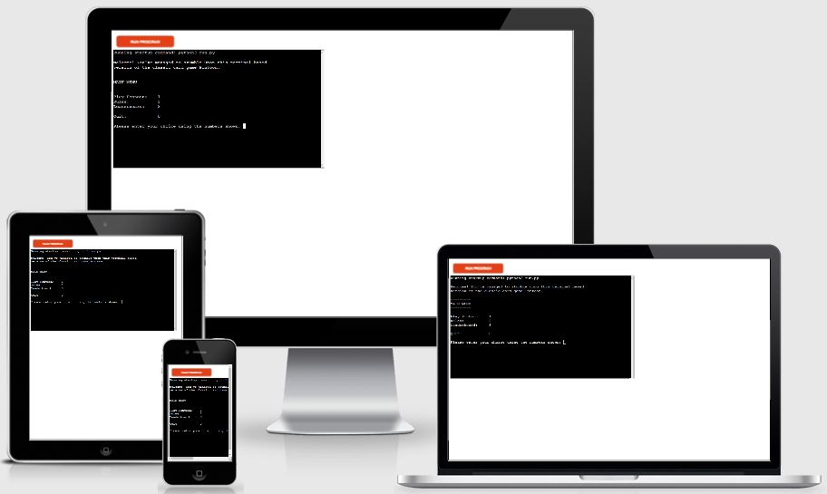
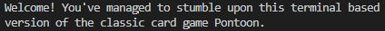
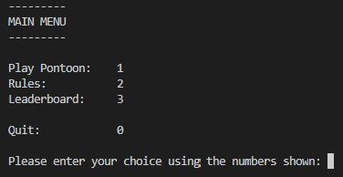
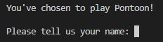
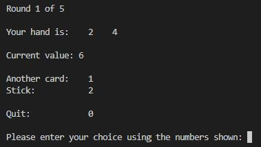
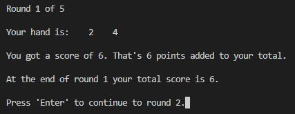
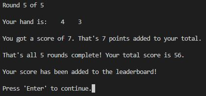
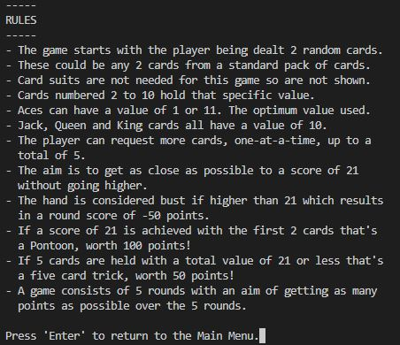

# Pontoon Game

[Click here to view the live site.](https://pontoon-game.herokuapp.com)

## Contents

- [Overview](#overview)
- [Game Rules](#game-rules)
- [User Experience (UX)](#user-experience)
    - [Strategy Plane](#strategy-plane)
    - [Scope Plane](#scope-plane)
    - [Structure Plane](#structure-plane)
    - [Skeleton Plane](#skeleton-plane)
    - [Surface Plane](#surface-plane)
- [Features](#features)
    - [Existing Features](#existing-features)
    - [Future Features](#future-features)
- [Data Model](#data-model)
- [Testing](#testing)
    - [Validator Testing](#validator-testing)
    - [Bugs](#bugs)
- [Deployment](#deployment)
- [Credits](#credits)

## Overview

This is Python terminal game based on the classic card game Pontoon, which runs in the Code Institute's mock terminal on Heroku. It is simple, easy to use, and is fun. Success is based on chance and judgement, and the player's final score is added to a leaderboard to add a further competative element.

## Game Rules

The following rules can also be seen within the game itself.

- The game starts with the player being dealt 2 random cards.
- These could be any 2 cards from a standard pack of cards.
- Card suits are not needed for this game so are not shown.
- Cards numbered 2 to 10 hold that specific value.
- Aces can have a value of 1 or 11. The optimum value used.
- Jack, Queen and King cards all have a value of 10.
- The player can request more cards, one-at-a-time, up to a total of 5.
- The aim is to get as close as possible to a score of 21 without going higher.
- The hand is considered bust if higher than 21 which results in a round score of -50 points.
- If a score of 21 is achieved with the first 2 cards that's a Pontoon, worth 100 points!
- If 5 cards are held with a total value of 21 or less that's a five card trick, worth 50 points!
- A game consists of 5 rounds with an aim of getting as many points as possible over the 5 rounds.

## User Experience

The five planes of user experience were considered during the design phase of this website, which are all outlined below.

### Strategy Plane

Here, the user goals are considered and outlined to have a clear understanding of what thought process users of the site are likely to go through, and what they might expect from the game. 

The aim is to provide ideas for potential features for the website.

#### User Goals
- __As a user I would like:__
    - to play a game based on chance and judgement.
    - to easily navigate through the game with no ambiguity.
    - to have plenty of relevant feedback.
    - to be able to compare my results with other players.
    - to be able to read the rules of the game.
    - to be able to play against the computer.

### Scope Plane

All of the user goals outlined in the strategy plane all seem to be plausible for the first release of the game. Although for this particular game, playing against the computer would add another layer of complexity which I don't feel would provide enough of a difference to the user's experience to warrant implementing at this stage. For this reason it won't be included.

### Structure Plane

The game will have a welcome message shown only when the game is first loaded. From then on, a main menu is shown with various options for the user to choose from - Play Pontoon, See Rules, See Leaderboard and Quit. They will be notified if they don't select a valid option and asked to try again.

See Rules and See Leaderboard are self explanatory, though it's worth mentioning that the terminal is cleared before either are shown, and then cleared again on returning to the main menu.

Play Pontoon takes the user to the game itself, firstly asking them for their name. This can include any characters but is limited to only 10 in length. The name is used for their score to be added to the leaderboard once a game has been completed. Next, the terminal is cleared and the main game screen is shown. The player's initial hand is shown along with its current value. The player can then choose from some options - Add another card to their hand, Stick with what the currently have, or to Quit.

Once the player has either gone bust, got a five card trick, or has chosen to stick with what they have, they are notified of their score for the round and can then continue to the next round where the process is repeated. Once all 5 rounds have been completed they're shown their final score which is then added to the leaderboard. They are then returned to the main menu.

During the game the player has the option of quiting. If this is selected they're asked if they'd actually like to quit. If so then they're returned to the main menu, if not they're returned to the game.

### Skeleton Plane

### Surface Plane

Since this is a terminal based game there is not much to consider in terms of the surface plane.

## Features

### Existing Features

- __Welcome Message__

    - The welcome message is shown only when the game is first loaded.
    - Its purpose is to welcome the user to the game.

        

- __Main Menu__

    - The main menu gives the user 4 options to choose from: to play Pontoon, to see the rules, to see the leaderboard, or to quit.
    - Its purpose is to act as a hub that is used to access all parts of the game. It is returned to once the user has finished with any other part of the game.

        

- __Request Name Screen__

    - This is shown when the user selects to play Pontoon. It asks the user for their name. A maximum of 10 characters is allowed. An error message is shown if longer than 10 characters. If nothing is typed, or only spaces typed then the name "UNKNOWN" is used.
    - Its purpose is to retrieve the user's name, which is used when adding their score to the leaderboard.

        

- __Game Menu__

    - The game menu is shown during actual gameplay. It displays the players current hand and its current value. It also gives the user 3 options: to add another card to their hand, to stick with what they've got, or to quit.
    - Its purpose is to show the user what their hand is, its value, and to allow the user to choose what they'd like to do next.

        

- __End Round Screen__

    - This shown at the end of each round. It also displays the player's hand and its value. Beneath, it lets the player know what their score for the round was, their cumlative score so far, and let's them know that they can now continue to the next round.
    - Its purpose is to update the user on how they did during the round.

        

- __Quit Screen__

    - This is shown when the user selects to quit whilst in-game. It asks them if they're sure they'd like to quit.
    - Its purpose is to allow the user to have a second chance decision on quitting in case they've changed their mind, or selected quit by accident.

        

- __End Game Screen__

    - This shown at the end of the game once 5 rounds have been completed. Similarly to the end round screen it displays the player's final hand, its value, and their cumlative total score. Beneath this it lets the player know that their score has been added to the leaderboard, and let's them know that they can now return to the main menu.
    - Its purpose is to update the user on their final results for the 5 round game.

        

- __Rules Screen__

    - The rules screen simply shows the user the rules of the game. The main menu can easily be returned to from here.
    - Its purpose is to allow the user to read the rules of the game.

        

- __Leaderboard Screen__

    - The leaderboard screen shows the user the top scores - up to a maximum of 10 - of the games played so far. The main menu can easily be returned to from here.
    - Its purpose is to allow the user to see what scores previous players have achieved, or to see if they have made it into the top 10.

        

### Future Features

- Allow the player to play against the computer, in the style of blackjack.

## Data Model

I decided to implement 3 different classes for this project: a Pack of Cards class, a Hand class, and a Pontoon class. 

The Pack of Cards class represents a pack of 52 cards and has a method to return a random card from the pack. This method simulates removing that card from the pack so when the next card is drawn any previously drawn cards cannot be drawn again. There is also a method to reset the pack to its default settings. Although this method has not been used within this project, I thought it made sense to add it to the class.

The Hand class represents a players hand. It has an optional paramter of a Pack of Cards object. If omitted it creates its own Pack of Cards object. The reason I added the optional parameter was for future maintainability, for example, 2 Hand objects drawing from the same Pack of Cards object. Though this wasn't actually needed for the project in its current state.

The Hand class has methods to show which cards are in the hand, to add to the hand, to return the value of the hand, and to return the size of the hand (how many cards).

The Pontoon Class represents the game itself. It has some constant variables declared for all pontoon objects which affect the game's scoring system. It has multiple other variables including a Hand object to represent the player's hand. Its main method is called play which runs the game's main loop. At the end of each round the end game function is called, displaying various different messages depending on the outcome. Once all 5 rounds have been completed the update leaderboard function is called which does just that. The class also has a quit function which is called when the player chooses to quit, and a request name function which is called before the first loop of the game.

## Testing

Throughout the development of this project I have tested it to make sure each part of it acts as I expect it to. Where user input is required I've tested for many invalid entires to make sure that the user is made aware of their error, and that they have the option to try again. I've made sure that the program logic flows correctly by playing through the game many times, sometimes amending the code so that specific outcomes occured so I could make sure everything acted as expected. When necessary, I used print statements to check variable values.

Most of the testing was done in the local terminal, but I've also tested it in the Code Institute's Heroku terminal after deployment.

### Validator Testing

I passed the code through a [PEP8 linter](http://pep8online.com/) which said that my code was "All right".

### Bugs

#### Fixed Bugs

- When I added the constant variables to the Pontoon class I noticed that when the player's score was being added up it was using +100 points for going bust instead of -100 points. I hadn't changed the formula to account for the negative value of the constant variable so I was subtracting twice. This was easily fixed by amending the minus sign to a plus sign.

- When I first created the game loop I noticed that I could keep adding cards to my hand until I went bust even though a maximum of only 5 cards is supposed to be allowed. I fixed this by adding an elif statement which checks if the hand size is 5 when adding another card, and if so changing the end round variable to true so that the loop ends on the next try.

- When I initially added the leaderboard page I noticed that it was taking a while to load during which time the display was blank. I thought the player might misinterpret this to mean that it had crashed so I decided to put a loading message onto the screen during this time.

- I noticed that when the player got a Pontoon they still had the option to add another card. I decided that it would be better if the round finished automatically in this case. To solve this I added an if statement that checks the player's hand to see if they've got Pontoon, and if so, change the end round variable to true so that the round ends.

#### Unfixed Bugs

- No bugs remaining.

## Deployment

This project was deployed using Code Institute's mock terminal for Heroku.

The steps I followed for deployment were:

- Make sure the most up to date code has been pushed to the GitHub repository.
- Login into Heroku and create a new Heroku app.
- Once created go to the settings tab.
- Add a Config Var with the key CREDS, then copy and paste the contents of the creds.json file (found within the GitHub repository) as the value.
- Add another Config Var with a key of PORT and a value of 8000.
- Now add Buildpacks for Python and NodeJS in that order. The order is important.
- Now go to the Deploy tab.
- Connect the Heroku app to the GitHub repository.
- Click on Deploy and wait for confirmation fo deployment.

## Credits

- [Code Institute's Full Stack Developer Course](https://codeinstitute.net/)
    - Course material and the Love Sandwiches walkthrough projects provided some ideas.
    - Their deployment terminal.

- [Stack Overflow](https://stackoverflow.com/questions/2084508/clear-terminal-in-python)
    - For the code to clear the terminal.
