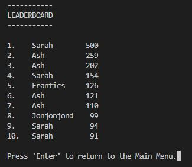

# Pontoon Game

## Contents

## Overview

This is Python terminal game based on the classic card game Pontoon, which runs in the Code Institute's mock terminal on Heroku. It is simple, easy to use, and is fun. Success is based on chance and judgement, and the player's final score is added to a leaderboard to add a further competative element.

## Game Rules

The following rules can also be seen within the game itself.

- The game starts with the player being dealt 2 random cards.
- These could be any 2 cards from a standard pack of cards.
- Card suits are not needed for this game so are not shown.
- Cards numbered 2 to 10 hold that specific value.
- Aces can have a value of 1 or 11. The optimum value used.
- Jack, Queen and King cards all have a value of 10.
- The player can request more cards, one-at-a-time, up to a total of 5.
- The aim is to get as close as possible to a score of 21 without going higher.
- The hand is considered bust if higher than 21 which results in a round score of -50 points.
- If a score of 21 is achieved with the first 2 cards that's a Pontoon, worth 100 points!
- If 5 cards are held with a total value of 21 or less that's a five card trick, worth 50 points!
- A game consists of 5 rounds with an aim of getting as many points as possible over the 5 rounds.

## User Experience

The five planes of user experience were considered during the design phase of this website, which are all outlined below.

### Strategy Plane

Here, the user goals are considered and outlined to have a clear understanding of what thought process users of the site are likely to go through, and what they might expect from the game. 

The aim is to provide ideas for potential features for the website.

#### User Goals
- __As a user I would like:__
    - to play a game based on chance and judgement.
    - to easily navigate through the game with no ambiguity.
    - to have plenty of relevant feedback.
    - to be able to compare my results with other players.
    - to be able to read the rules of the game.
    - to be able to play against the computer.

### Scope Plane

All of the user goals outlined in the strategy plane all seem to be plausible for the first release of the game. Although for this particular game, playing against the computer would add another layer of complexity which I don't feel would provide enough of a difference to the user's experience to warrant implementing at this stage. For this reason it won't be included.

### Structure Plane

The game will have a welcome message shown only when the game is first loaded. From then on, a main menu is shown with various options for the user to choose from - Play Pontoon, See Rules, See Leaderboard and Quit. They will be notified if they don't select a valid option and asked to try again.

See Rules and See Leaderboard are self explanatory, though it's worth mentioning that the terminal is cleared before either are shown, and then cleared again on returning to the main menu.

Play Pontoon takes the user to the game itself, firstly asking them for their name. This can include any characters but is limited to only 10 in length. The name is used for their score to be added to the leaderboard once a game has been completed. Next, the terminal is cleared and the main game screen is shown. The player's initial hand is shown along with its current value. The player can then choose from some options - Add another card to their hand, Stick with what the currently have, or to Quit.

Once the player has either gone bust, got a five card trick, or has chosen to stick with what they have, they are notified of their score for the round and can then continue to the next round where the process is repeated. Once all 5 rounds have been completed they're shown their final score which is then added to the leaderboard. They are then returned to the main menu.

During the game the player has the option of quiting. If this is selected they're asked if they'd actually like to quit. If so then they're returned to the main menu, if not they're returned to the game.

### Skeleton Plane

### Surface Plane

Since this is a terminal based game there is not much to consider in terms of the surface plane.

## Features

- __Welcome Message__

    - The welcome message is shown only when the game is first loaded.
    - Its purpose is to welcome the user to the game.

        

- __Main Menu__

    - The main menu gives the user 4 options to choose from: to play Pontoon, to see the rules, to see the leaderboard, or to quit.
    - Its purpose is to act as a hub that is used to access all parts of the game. It is returned to once the user has finished with any other part of the game.

        

- __Request Name Screen__

    - This is shown when the user selects to play Pontoon. It asks the user for their name. A maximum of 10 characters is allowed. An error message is shown if longer than 10 characters. If nothing is typed, or only spaces typed then the name "UNKNOWN" is used.
    - Its purpose is to retrieve the user's name, which is used when adding their score to the leaderboard.

        

- __Game Menu__

    - The game menu is shown during actual gameplay. It displays the players current hand and its current value. It also gives the user 3 options: to add another card to their hand, to stick with what they've got, or to quit.
    - Its purpose is to show the user what their hand is, its value, and to allow the user to choose what they'd like to do next.

        

- __End Round Screen__

    - This shown at the end of each round. It also displays the player's hand and its value. Beneath, it lets the player know what their score for the round was, their cumlative score so far, and let's them know that they can now continue to the next round.
    - Its purpose is to update the user on how they did during the round.

        

- __Quit Screen__

    - This is shown when the user selects to quit whilst in-game. It asks them if they're sure they'd like to quit.
    - Its purpose is to allow the user to have a second chance decision on quitting in case they've changed their mind, or selected quit by accident.

        

- __End Game Screen__

    - This shown at the end of the game once 5 rounds have been completed. Similarly to the end round screen it displays the player's final hand, its value, and their cumlative total score. Beneath this it lets the player know that their score has been added to the leaderboard, and let's them know that they can now return to the main menu.
    - Its purpose is to update the user on their final results for the 5 round game.

        

- __Rules Screen__

    - The rules screen simply shows the user the rules of the game. The main menu can easily be returned to from here.
    - Its purpose is to allow the user to read the rules of the game.

        

- __Leaderboard Screen__

    - The leaderboard screen shows the user the top scores - up to a maximum of 10 - of the games played so far. The main menu can easily be returned to from here.
    - Its purpose is to allow the user to see what scores previous players have achieved, or to see if they have made it into the top 10.

        